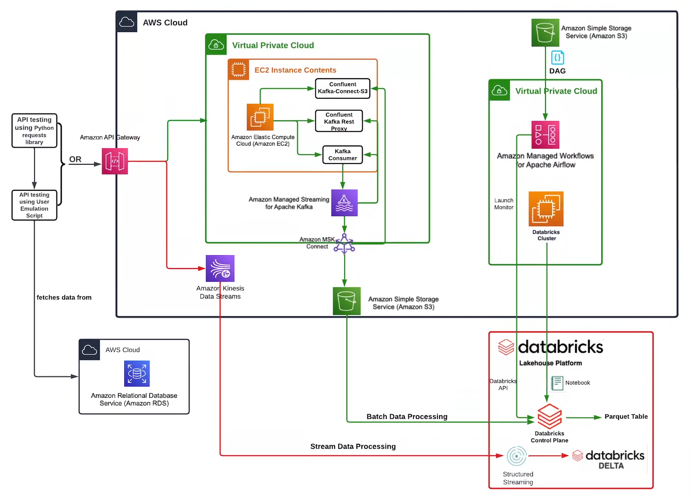

# Pinterest Data Pipeline Project

[git repository link](https:/git /github.com/Saqub88/pinterest-data-pipeline422)

## Table of Contents

1. A description of the project
2. Installation instructions
3. Usage instructions
4. File structure of the project
5. License information

## 1.  Description of the project

Pinterest crunches billions of data points every day to decide how to provide more value to their users. In this project, I will create a similar system using the AWS Cloud.

The project starts with data being randomly selected from an AMAZON RDS which then sent at random intervals. This is to mimic realtime data generated by user posts.

The data for this project is run through 2 different pipelines.
    1. The Stream data Processing Pipeline processes the data in realtime.
    2. The Batch data processing pipeline processes historical data

Both processed take advantage of the resources provided by AWS, specifically EC2 instances, S3 storage, Managed streaming for Apache Kafka, Managed Apache Airflow, Kinesis, MSK connect and API gateways. Before the data is processed, cleaned and stored in Databricks tables, the Kinesis API and AWS S3 storage need to be authenticated/mounted in Databricks in order for the data to be read. Ultimately once the data is processed/cleaned, it is stored into parquet or Databricks delta tables.

## 2.  Installation Instructions

Make directory.

download repository and unpack into directory

install the required pip packages using the included 'requirements.txt' file with the following command

            pip install -r requirements.txt

## 3.  Usage Instructions

### Batch processing
1. To connect to the EC2 instance that hosts the Kafka server, access the termminal or command prompt and enter the following :

            ssh -i "<USER_ID-key-pair.pem>" ec2-user@<Public IPv4 DNS>

2. Once connected, navigate to the "confluent-7.2.0/bin" folder and enter the following :

            ./kafka-rest-start /home/ec2-user/confluent-7.2.0/etc/kafka-rest/kafka-rest.properties

3. Once the "confluent" is ready and listening to messages, run the 'user_posting_emulation_batch.py' file to begin the simulation of user posts.

### Streaming
1. Run the 'user_posting_emulation_streaming.py'

## 4.  File Structure of the project

Any original files are stored within 'Backup of original files' folder.

A copy of the workspace created for Databricks is stored in the 'Databricks workspace copy' folder. 
The files within this folder are only a copy of the files from the databricks workspace. The project does not utilise the copies but are here only for reference.
'0aa58e5ad07d.pin.py', '0aa58e5ad07d.geo.py' and '0aa58e5ad07d.user.py' contain the code for cleaning their respective table.
'Data querries.py' contains the codes for querrying the tables and creating a dataframe for the results.

Login credentials and keys are stored within 'Sensitive data' folder.
both of these folders are not pushed to GitHub for security reasons.

The copy of the DAG for the project which utilised in Apache Airflow is located in the 'DAGs' folder.

## 5.  License information

No license information provided at this time.